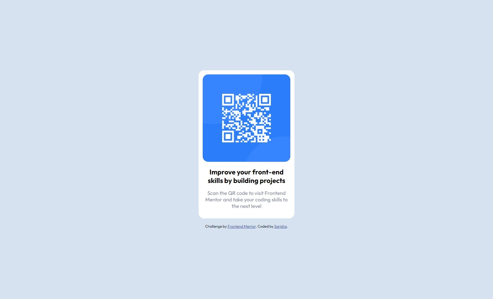

# Frontend Mentor - QR code component solution

This is a solution to the [QR code component challenge on Frontend Mentor](https://www.frontendmentor.io/challenges/qr-code-component-iux_sIO_H). Frontend Mentor challenges help you improve your coding skills by building realistic projects. 

## Table of contents

- [Overview](#overview)
  - [Screenshot](#screenshot)
  - [Links](#links)
- [Built with](#built-with)
- [Author](#author)

## Overview

### Screenshot

### Links

- [Solution URL](https://www.frontendmentor.io/solutions/qr-code-component-using-flex-WE_QhE9z8I)
- [Live Site URL](https://challenge-qr-code-component-7u4u36o06-sarisha-pr.vercel.app/)

## Built with

- Semantic HTML5 markup
- CSS custom properties

## Author
- Frontend Mentor - [@sarisha-pr](https://www.frontendmentor.io/profile/sarisha-pr)
- Github - [@sarisha-pr](https://github.com/sarisha-pr)
